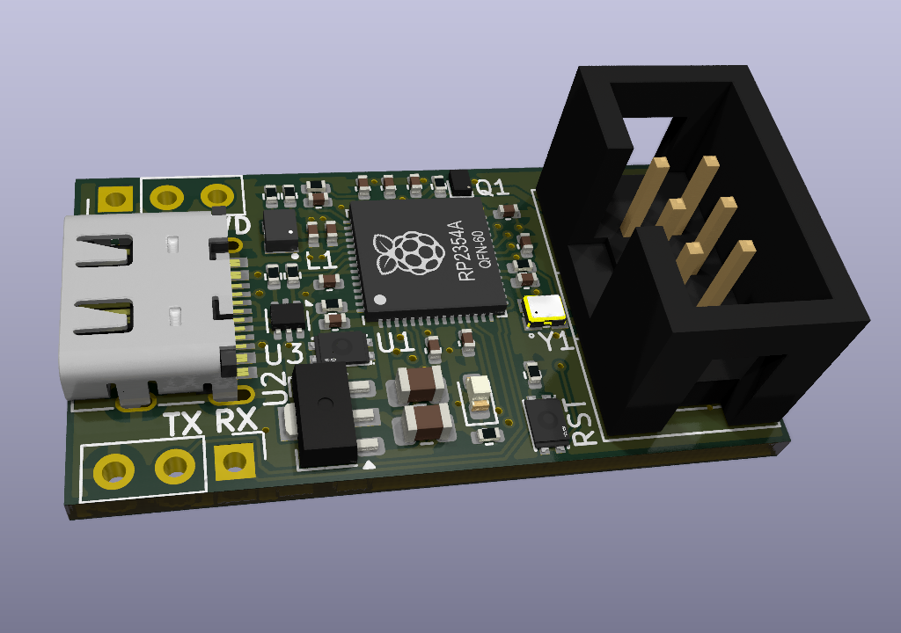
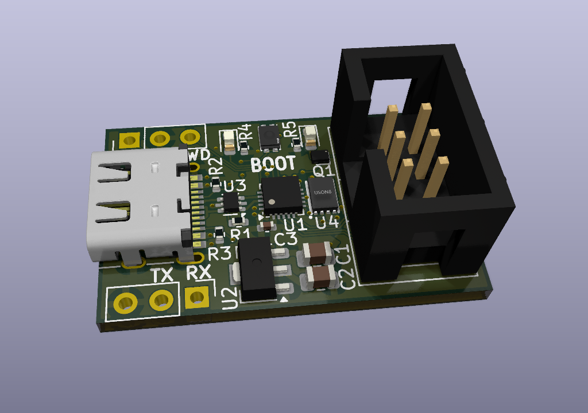

# ChickenBoot

## PCB design files

There are two board designs: one based in a MCU from WCH, the other based in a Raspberry Pi Pico.  

for details, read [Design document](DESIGN.md)

## View the boards online:  
The inteactive viewer allows to explore the design in full without need of installing any tools  

- [RPI based design](https://kicanvas.org/?repo=https%3A%2F%2Fgithub.com%2Fsuarezvictor%2Fchickenboot%2Ftree%2Fmain%2Fhardware%2Fchickenboot-rpi)

- [WCH based design](https://kicanvas.org/?repo=https%3A%2F%2Fgithub.com%2Fsuarezvictor%2Fchickenboot%2Ftree%2Fmain%2Fhardware%2Fchickenboot-jtag-wch)

  
  

